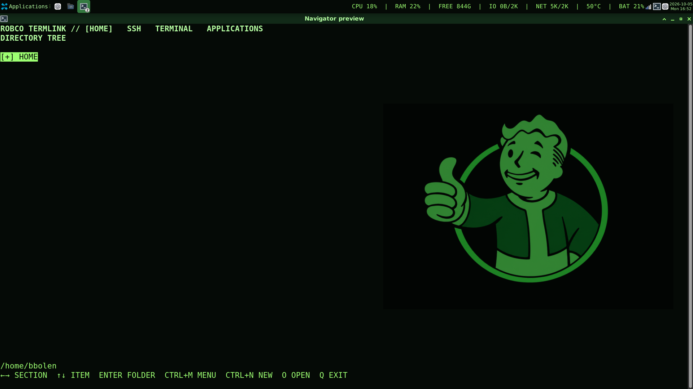

# Fallout XFCE

A Pip-Boy inspired XFCE desktop: bright green on black, a 36px system panel, and a full-height F12 navigator with embedded terminals.



## Quick start

Tested on **Debian 13, XFCE, X11**. Copy the entire project to a permanent directory, then run these commands from a terminal in your logged-in desktop session:

```sh
./install.sh --check  # Read-only dependency check
./install.sh          # Install missing packages and configure the desktop
```

Run as your normal user. The installer uses sudo only for missing Debian packages and checks GTK, VTE, and audio support before changing desktop settings. Keep the project directory in place: desktop launchers and wallpaper reference its files.

Installation sets the Pip-Boy wallpaper on connected monitors and workspaces, disables wallpaper cycling, and hides desktop icons. Desktop launchers (`.desktop` files) and symbolic links are moved into the backup; ordinary files and folders are kept. Restore returns removed shortcuts when their original paths are unoccupied.

Press **F12** to show or hide the navigator. If F12 already has a custom binding, the installer uses **Ctrl+Alt+F12**.

Restore the captured desktop configuration with:

```sh
./restore.sh
```

The first backup is preserved at `~/.local/state/fallout-ui/original`; reinstalling never replaces it. Restore replaces subsequent changes to the captured desktop settings. Installed system packages remain installed.

The navigator background is transparent by default, showing your desktop behind the green text. Toggle **Settings → Transparent background** to switch to the opaque Pip-Boy background; the preference saves immediately. Installation enables XFCE compositing for transparency.

## Everyday controls

| Control | Action |
| --- | --- |
| Left / Right | Switch Home, SSH, Terminal, Applications, Settings |
| Up / Down, Enter | Select and open |
| Backspace / Escape | Return or cancel |
| Ctrl+M on a file | File actions |
| Ctrl+N on a directory | Create a file or directory |
| O | Open a document or start a shell in a directory |
| H | Toggle hidden files |
| Ctrl+] in a terminal | Return to the navigator; keep the session running |
| Ctrl+Up / Ctrl+Down | Switch running terminal sessions |
| Ctrl+Shift+C / V | Copy / paste terminal text |
| Q in the navigator | Exit; confirm closing active sessions |

Text documents open in embedded Nano. GUI applications hide the navigator; F12 brings it back. Sessions persist while hidden but close when the navigator quits.

## Features and guide

- File browsing, safe copy/move/rename, Trash, ZIP compression, and desktop application opening.
- Saved SSH hosts, Ed25519 key generation, public-key installation and tracked revocation.
- Independent native VTE terminals with scrollback and separate navigator, shell, and editor fonts.
- CPU, memory, disk, network, temperature, and battery panel metrics.
- Optional click-through CRT scanlines and animation, plus configurable sound effects and fan hum.

See the [full user guide](docs/user-guide.md) for SSH workflows, file actions, CRT setup, sound behavior, configuration locations, and limitations. SCP remains a placeholder.

## Development

Run the unit tests and syntax checks without applying desktop settings:

```sh
python3 -m unittest discover -s scripts -p 'test_*.py'
python3 -m py_compile scripts/*.py
sh -n install.sh restore.sh scripts/terminal.sh scripts/install_dependencies.sh
```

The two GUI integration scripts are skipped by unit-test discovery. Run them directly with system Python from an XFCE desktop session:

```sh
/usr/bin/python3 scripts/test_embedded_rpc.py
/usr/bin/python3 scripts/test_embedded_gui.py
```

| Location | Responsibility |
| --- | --- |
| `scripts/browser.py`, `scripts/navigator_tree.py` | Curses menus and directory tree |
| `scripts/embedded_app.py`, `scripts/embedded_client.py` | GTK/VTE host and local socket bridge |
| `scripts/session.py`, `scripts/terminal_sessions.py` | Operations and fallback PTY sessions |
| `scripts/ssh_manager.py`, `scripts/file_actions.py` | SSH catalog and file operations |
| `scripts/metrics.py` | One-shot panel collector |
| `scripts/crt_*.py`, `scripts/sounds.py` | Desktop effects and audio |
| `scripts/setup.py`, `scripts/install_dependencies.sh` | Backup, install, restore, dependency checks |
| `theme/`, `assets/`, `logo/`, `fallout-sounds/` | Desktop theme and media |
| `vendor/` | Bundled fallback libraries and license notices |

Metrics refresh every two seconds; screen width is checked at most once a minute. A resolution change can take up to a minute to switch between compact and full panel labels.
